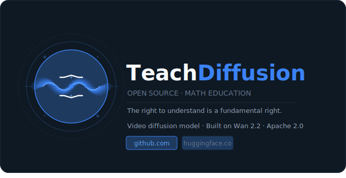

<p align="center">
  
</p>

<h3 align="center">Open-Source Video Diffusion for Math Education</h3>

<p align="center">
  <em>The right to understand is a fundamental right.</em>
</p>

<p align="center">
  <a href="https://github.com/TeachDiffusion/TeachDiffusion/blob/main/LICENSE"></a>
  <a href="https://www.python.org/downloads/"></a>
  <a href="https://github.com/Wan-Video/Wan2.2"></a>
  <a href="https://www.manim.community/"></a>
  <a href="https://huggingface.co/TeachDiffusion"></a>
  <a href="https://github.com/TeachDiffusion/TeachDiffusion/stargazers"></a>
  <a href="../CONTRIBUTING.md"></a>
  <a href="../VERSION_CONTROL_GUIDE.md"></a>
</p>

---

## What Is TeachDiffusion?

TeachDiffusion is an open-source AI system that generates math teaching videos featuring a realistic AI human teacher. It doesn't give you answers — it gives you **understanding**.

Built on a fine-tuned [Wan 2.2](https://github.com/Wan-Video/Wan2.2) video diffusion model, TeachDiffusion generates teaching videos where an AI teacher explains concepts with the depth, patience, and pedagogical intelligence of a true expert. It builds intuition before formalism. It works through examples step by step. It anticipates where students get confused and addresses it directly.

## Why?

Quality math education is one of the most unequally distributed resources on earth. Not everyone can afford a great teacher. Not everyone has access to one. TeachDiffusion exists to change that — permanently, for free.

## Project Status

**Active development — pre-release.** The 8-layer pipeline is scaffolded end-to-end (with the video-diffusion layer running in stub mode). The next milestones are dataset curation, LoRA fine-tuning on Wan 2.2, and the v0.1.0 weight release. See the [Roadmap](#roadmap) for specifics.

## Repositories

| Repository | Purpose |
|---|---|
| [`TeachDiffusion`](https://github.com/TeachDiffusion/TeachDiffusion) | Core Python package — all 8 layers |
| [`teachdiffusion-data`](https://github.com/TeachDiffusion/teachdiffusion-data) | Dataset pipeline (scrape, caption, segment, filter) |
| [`teachdiffusion-training`](https://github.com/TeachDiffusion/teachdiffusion-training) | LoRA fine-tuning scripts and RunPod setup |
| [`teachdiffusion-space`](https://github.com/TeachDiffusion/teachdiffusion-space) | HuggingFace Space demo (Gradio) |

## Architecture — 8 Layers

```
User Input (topic / question)
        │
        ▼
┌─────────────────────┐
│  1. Knowledge Base   │  34+ math concepts, prerequisites, definitions
└─────────┬───────────┘
          ▼
┌─────────────────────┐
│  2. Reasoning Engine │  Decompose topics, find gaps, build analogies
└─────────┬───────────┘
          ▼
┌─────────────────────┐
│  3. Pedagogy Planner │  Design lessons like expert teachers do
└─────────┬───────────┘
          ▼
┌─────────────────────┐
│  4. Student Model    │  Track knowledge, detect misconceptions
└─────────┬───────────┘
          ▼
┌─────────────────────┐
│  5. Explanation Gen  │  Layered: hook → intuition → formal → examples
└─────────┬───────────┘
          ▼
┌─────────────────────┐
│  6. Visualization    │  Manim animations — equations, graphs, proofs
└─────────┬───────────┘
          ▼
┌─────────────────────┐
│  7. Video Diffusion  │  Wan 2.2 + LoRA → realistic AI teacher video
└─────────┬───────────┘
          ▼
┌─────────────────────┐
│  8. Feedback & Eval  │  Quizzes, scoring, learning gain measurement
└─────────┬───────────┘
          ▼
    Update Student Model
```

## Branch Structure

Every repo in this organisation follows the same flow:

```
main  ←  dev  ←  feat/<name>  |  fix/<name>  |  chore/<name>  |  refactor/<name>  |  docs/<name>
```

- **`main`** — protected, release-quality only. Only updated via PR from `dev`. Requires linear history and signed commits.
- **`dev`** — integration branch. All feature/fix/chore branches PR into `dev`. Direct pushes blocked; PR required.
- **`feat/* · fix/* · chore/* · refactor/* · docs/*`** — short-lived branches, one per issue, PR'd into `dev`.

Every change starts with a GitHub issue. Every commit references that issue with `Closes #N`. See [VERSION_CONTROL_GUIDE.md](../VERSION_CONTROL_GUIDE.md) for the full workflow.

## Quick Start

```bash
git clone https://github.com/TeachDiffusion/TeachDiffusion.git
cd TeachDiffusion
pip install -e .

# Generate a teaching video
teachdiffusion generate --topic "quadratic equations" --output lesson.mp4
```

Python API:

```python
from teachdiffusion.pipeline.orchestrator import TeachDiffusionPipeline

pipeline = TeachDiffusionPipeline()
result = pipeline.generate_lesson(
    topic="quadratic equations",
    student_id="student_01",
    difficulty="intermediate",
)
```

## What Makes It Novel

The key original contribution is the **pedagogy-aware conditioning system** — a schema that encodes teaching intent (step type, gesture, pacing, difficulty) directly into video generation prompts. Nobody has built this for math education specifically.

```python
from teachdiffusion.pedagogy.schema import TeachingStep, StepType, GestureType

step = TeachingStep(
    step_number=1,
    step_type=StepType.BUILD_INTUITION,
    content="Before we touch any formulas, let's understand what a quadratic really means...",
    gesture=GestureType.OPEN_HAND,
    pacing="slow",
    visual_cue="Show parabola forming from thrown ball trajectory",
)
```

## Roadmap

- [x] Knowledge base with 34+ math concepts
- [x] Reasoning engine with decomposition and analogy generation
- [x] Pedagogical planner with Claude API integration
- [x] Student model with misconception detection
- [x] Explanation generator with layered output
- [x] Visualization engine with Manim
- [x] Video generation pipeline (stub mode)
- [x] Feedback and evaluation system
- [x] Full pipeline orchestrator
- [ ] Dataset collection and curation
- [ ] LoRA fine-tuning on Wan 2.2
- [ ] v0.1.0 weight release
- [ ] HuggingFace Space demo

## Requirements

- Python 3.10+
- [Anthropic API key](https://console.anthropic.com/) (for reasoning + pedagogy layers)
- FFmpeg (for video compositing)
- Manim (for math animations)
- GPU with 40GB+ VRAM (for video generation — not needed for development)

## Contributing

Read [CONTRIBUTING.md](../CONTRIBUTING.md) first — every change starts with an issue and goes through a PR into `dev`. The full workflow (branch naming, commit format, PR template, CI rules, merge policy) lives in [VERSION_CONTROL_GUIDE.md](../VERSION_CONTROL_GUIDE.md).

## Citation

```bibtex
@software{teachdiffusion2026,
  title={TeachDiffusion: Open-Source Video Diffusion for Math Education},
  author={Calyx},
  year={2026},
  url={https://github.com/TeachDiffusion/TeachDiffusion},
  license={Apache-2.0}
}
```

## License

Apache 2.0 — free forever. See [LICENSE](LICENSE).

---

<p align="center">
  <strong>The right to understand is a fundamental right.</strong><br>
  Built by <a href="https://github.com/calyxish">Calyx Ish</a> · Apache 2.0 · Free forever
</p>
